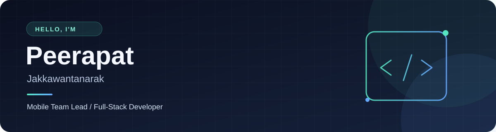

  

  <h3>Software Developer · Bangkok, Thailand 🇹🇭</h3>
  
Business systems &nbsp;•&nbsp; Web applications &nbsp;•&nbsp; Mobile experiences

  

    
    
  

---

### 👋 A little about me

I build practical software for the web and mobile. At **Tigersoft**, I work with clients on HR and payroll systems, turning complex requirements into reliable features. My background spans Laravel web apps, Flutter mobile apps, and computer and robotics engineering.

| 💼 Currently | 🧭 Interested in | 🎓 Background |
| :--- | :--- | :--- |
| Consultant Software Developer at Tigersoft | Go, microservices, and cloud architecture | B.Eng. Computer & Robotics, Bangkok University |

### 🛠️ My toolkit

**Business systems** 

**Web & mobile** 

### ✨ Selected projects

| Project | What it explores |
| :--- | :--- |
| [**Clothing Matching App**](https://github.com/TungPeerapat/flutter_finalproject_finder) | A Flutter final project for outfit matching and clothing discovery. [View the design ↗](https://www.figma.com/file/uVLBRFsW0ObIxBJaG4Jeuq/Matching?type=design&node-id=2118%3A3424&mode=design&t=ug9SROlxTGeKY5Gh-1) |
| [**Inventory Request System**](https://github.com/TungPeerapat/inventory-request-system) | Inventory requests with a Vue 3 frontend, .NET API, and MySQL. |
| [**Queue Ticket System**](https://github.com/TungPeerapat/queue-ticket-system) | Service queue management with Angular, Go, and SQL Server. |

### 💼 Experience

**Consultant Software Developer** · Tigersoft (1998) Co., Ltd. 
*Jan 2026 – Present* 
Consult on HR and payroll solutions, guide technical improvements, and support client needs. Promoted from Associate Software Developer.

**Associate Software Developer** · Tigersoft (1998) Co., Ltd. 
*Aug 2025 – Dec 2025* 
Developed and maintained HR and payroll features, customized systems for clients, and resolved technical issues.

**Fullstack Developer Intern** · Hyphen Plus Co., Ltd. 
*2024* 
Built Laravel web applications, worked with database structures, and improved interfaces with Bootstrap.

### 🎓 Education

**B.Eng. Computer & Robotics Engineering** · Bangkok University, 2020–2025 
Worked with C/C++, Python, microcontrollers, IoT, robot control, and AI fundamentals.

---

   
  <strong>Let's build something useful.</strong> 
  <a href="mailto:tungpeerapat2002@gmail.com">tungpeerapat2002@gmail.com</a>

